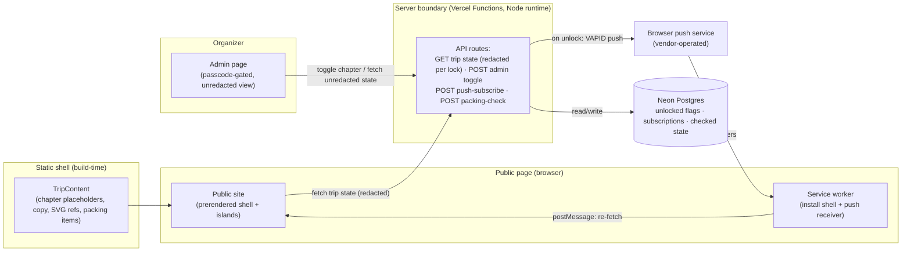
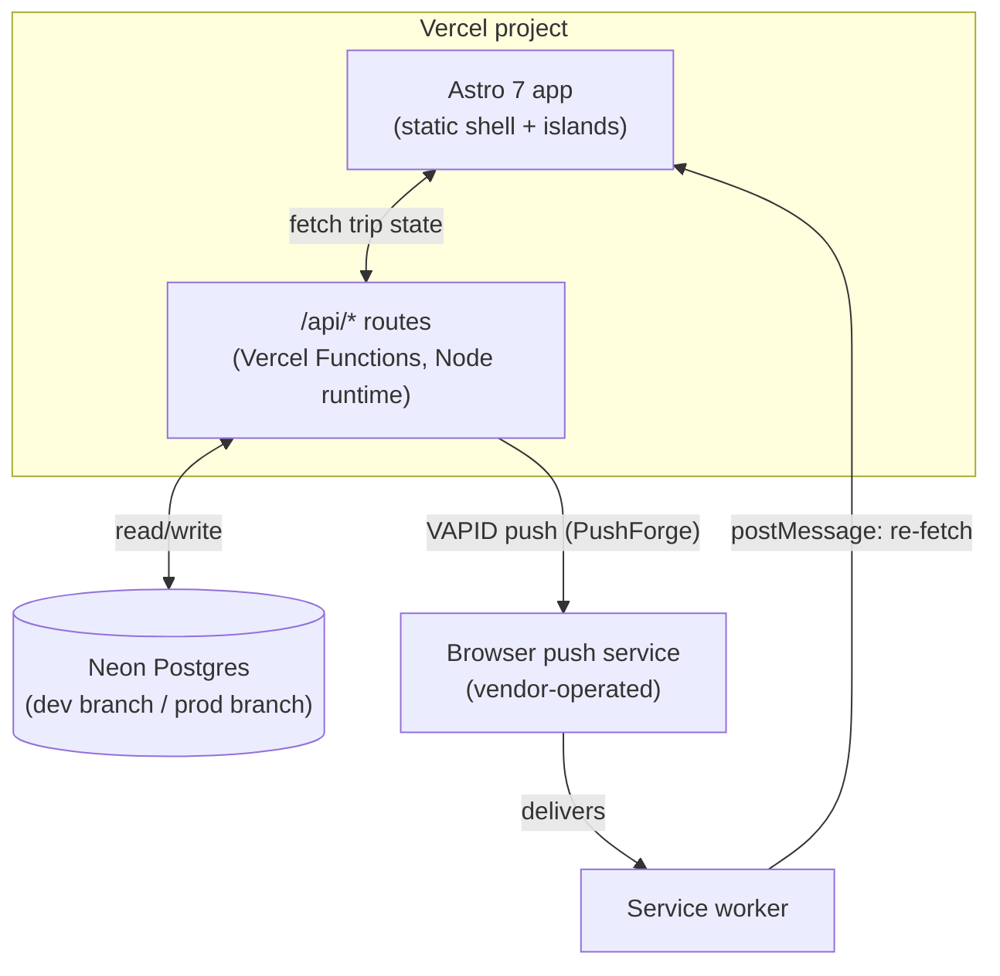

# Architecture Spine — Ameland Vriendenweekend PWA

## Design Paradigm

**Static shell, live content-fill PWA. Server owns only shared mutable state.**

Every trip is a static, prerendered page shell (nav, hero, install section, chapter slots in order). What fills each chapter slot is *not* baked into that static build: a locked chapter's real content (title, description, illustration) never ships to the client at all — only its placeholder does. The trip-state API is the sole source of real chapter content, redacting anything still locked. The only things stored and mutated server-side are: which chapters are unlocked, who has subscribed to push, and the packing-list checked state.



## Invariants & Rules

### AD-1 — Static-first paradigm boundary

- **Binds:** all
- **Prevents:** ad-hoc client-side unlock logic reappearing — the current mockup (`Main.dc.html`) has zero conditional logic on `unlocked` at all; every chapter always renders regardless of the admin toggle.
- **Rule:** Only the page *shell* (structure, nav, hero, install flow, chapter slot order) is static/prerendered. A chapter's real content (title, description, time, location, illustration) is never part of that static build — it is fetched live and merged into the shell client-side per AD-2. Only `unlocked` (per chapter), push subscriptions, and packing-list checked-state are server-held mutable data; nothing else is read from or written to the database.
  - **Astro mechanics:** `astro.config.mjs` sets `output: 'server'` (this app is fundamentally DB-backed via its API routes — Astro 5+ defaults to `'static'`, which the Vercel adapter alone does not change). `src/pages/[trip]/index.astro` explicitly sets `export const prerender = true` to keep the shell static per this rule despite the server-mode default. Every `src/pages/api/**` route and `src/pages/[trip]/admin.astro` explicitly set `export const prerender = false` — redundant under `output: 'server'`'s own default, but stated explicitly on each file so the routes stay correct even if the global default is ever revisited.

### AD-2 — Content-gating contract

- **Binds:** public rendering layer, trip-state API
- **Prevents:** two builders inventing incompatible gating (one hiding via CSS, another by omitting server-rendered markup, another via a client-only flag) — and, separately, the site's whole secrecy premise leaking because "static" was read as "ship everything, hide with CSS."
- **Rule:**
  - The **public** `GET /api/trip/[slug]` response redacts locked chapters server-side: a locked chapter's entry contains only `{id, order, kind, unlocked: false}` — never its real `title`/`description`/`time`/`location`/`svgVariant`. The static shell itself never embeds any chapter's real content; it only knows the existing placeholder pattern ("?" / "nog een verrassing onderweg").
  - The **admin** route consumes a separate, authenticated variant of the same data that is never redacted — consistent with BUILD_BRIEF's "organizer always sees everything, including what's still locked."
  - The packing-list section is exempt from all of the above and always renders in full.
  - `GET /api/trip/[slug]` always returns the full merged `TripState` shape (see AD-7), subject to the redaction above — never a dynamic-only patch. Both the public page's re-fetch (AD-4) and the admin page consume this same envelope shape.

### AD-3 — Mutation boundary

- **Binds:** all write paths, with two named exceptions below
- **Prevents:** a public-reachable chapter-toggle or debug endpoint breaking the secrecy premise the whole site depends on.
- **Rule:** Only the authenticated admin route may write chapter `unlocked` state. The public page and its read-only trip-state API (`GET /api/trip/[slug]`) expose no mutation. `push/subscribe` and `packing/check` are **intentional exceptions**, scoped narrowly to AD-4 and AD-6 respectively: both are public and unauthenticated by design, and each writes nothing outside its own named field(s).

### AD-4 — Push trigger coupling and delivery contract

- **Binds:** admin toggle route, service worker, public page
- **Prevents:** notification timing drifting from unlock timing; three incompatible "what happens after a push arrives" designs that would each technically satisfy a looser rule; dead push subscriptions accumulating forever.
- **Rule:**
  - The same server transaction that flips a chapter's `unlocked` to `true` fans out a Web Push notification (VAPID, via PushForge) to every stored subscription for that trip. No separate or scheduled notification path exists.
  - On receiving a push event, the service worker both calls `showNotification()` **and** broadcasts to every open client of that origin (`clients.matchAll` + `postMessage`), instructing a re-fetch of `GET /api/trip/[slug]`. The public page listens for that message and re-renders only from the fetch response — never from the push payload directly. The push payload is used for the notification's title/body only, never as a state-transport channel (a dropped/offline push must not leave the client in a stale state once it reconnects and re-fetches).
  - On a 404 or 410 response from the push service for a given subscription, the fan-out routine deletes that subscription row before completing. This is the only path by which a subscription is ever removed — no separate cleanup job, no manual unsubscribe route.

### AD-5 — Admin auth

- **Binds:** admin route protection
- **Prevents:** overbuilding (a full user/auth table for one organizer), underbuilding (BUILD_BRIEF flags there is currently *no* auth design), an organizer getting silently logged out mid-trip, and unlimited passcode-guessing against the one thing standing between a stranger and AD-4's protected write path.
- **Rule:**
  - A single shared passcode, stored as a server environment variable, gates the admin route. On correct entry the server sets an httpOnly, signed session cookie with an explicit long `Max-Age` (90 days) — not a browser-session-only cookie. The threat model is a stranger guessing the admin URL, not session hijacking; the organizer must not be re-prompted mid-trip.
  - The passcode-check route is throttled: a per-IP attempt counter (stored in Neon) allows at most 5 attempts per 15 minutes, returning `429` beyond that.
  - No user accounts, no OAuth, no per-organizer identity.

### AD-6 — Packing-list sharing model `[ADOPTED]`

- **Binds:** packing-list data shape and write endpoint
- **Prevents:** divergent shared-vs-per-device implementations of checked state, and a lost-update race between two friends checking the same item near-simultaneously.
- **Rule:** The packing list is one shared, trip-wide list; any participant's check/uncheck is visible to everyone, with no per-user identity. `packing/check` takes an explicit desired end-state (`{id, checked: boolean}`), never a bare toggle — the server performs a plain write, not a read-modify-write, so concurrent edits resolve by last-write-wins with no lost-update race. BUILD_BRIEF left the shared-vs-per-person question open; Tim has since confirmed shared/trip-wide is correct.

### AD-7 — Content-config data shape

- **Binds:** data layer boundary
- **Prevents:** a new trip requiring code changes instead of a new content entry (the reusable-template guarantee); the redeploy-silently-relocks-chapters bug that a single blended schema invites.
- **Rule:**
  - **`TripContent`** (on-disk, static, versioned in git — encoded via the Content Layer API at `src/content.config.ts`, a `glob()` loader over `src/content/trips/`, **not** the pre-Astro-5 `src/content/config.ts` + `type: 'content'` pattern, which silently no-ops under Astro 7): `{slug, startDate, accentColor, chapters: [{id, order, kind: 'cinematic'|'knap', title, time, location, description, svgVariant}], packingList: [{id, label}]}`. `time` and `location` are nullable, so a chapter can exist before its details are confirmed (e.g. Zondag's unconfirmed wadlopen slot). This shape **never** contains `unlocked` or packing checked-state, in any form, including as a seed/default value. `chapters[].id` and `packingList[].id` double as the Neon foreign keys stories 5 and 9 key rows on — the schema must `.refine()`-enforce uniqueness within each array, and both ids are a stable public contract: renaming one orphans existing unlock/checked state in the DB.
  - Trip entries are one JSON file per trip under `src/content/trips/` (JSON, not Markdown/frontmatter — the shape is nested structured data, not prose), named `<slug>.json` by convention. `slug` in the schema is the **only** source of truth for a trip's identity: the `glob()` loader's `generateId` derives the collection entry id from `data.slug`, not from the filename (verify the exact Content Layer API for a data-derived id at implementation time) — this rules out the filename and the schema field ever silently disagreeing. The glob pattern is scoped explicitly (e.g. `**/*.json` under `src/content/trips/`) so it can't match `.gitkeep` or other non-content files.
  - **`TripState`** (the API response shape, computed): `TripContent` merged with `{chapters: {[id]: {unlocked: boolean}}, packingChecked: {[id]: boolean}}` read live from Neon, defaulting to `false`/unchecked when absent from the DB. `unlocked`/checked-state exist only in Neon, created on first admin-toggle / packing-check.
  - `svgVariant` is a closed enum over the existing code-defined illustration treatments (the vizier/Europa layer, the Blokarten rig, the Brouwerij kettle, and the two "knap" treatments). AD-7's "no code change for a new trip" guarantee covers copy/timing/lock fields only: reusing an existing illustration treatment for a new trip is code-free, but a genuinely new cinematic treatment is a code addition, not a content-only change.
  - Push subscriptions carry a `tripSlug` field — subscriptions are per-trip; a new trip's content entry requires visitors to re-subscribe (no automatic carry-over of a previous trip's subscribers).

### AD-8 — Hosting & runtime `[ASSUMPTION]` `[web-verified]`

- **Binds:** all API routes
- **Prevents:** building against a runtime Vercel itself has deprecated for new projects.
- **Rule:** Deploy to Vercel. All API routes (admin toggle, push subscribe, packing check, trip-state read) run as **Vercel Functions on the Node.js runtime** — Vercel deprecated standalone Edge Functions outright for new projects (as of its docs updated 2026-07-29) and consolidated on Node.js as the default runtime under Fluid Compute; this is a platform default being followed, not a niche crypto-compatibility workaround (PushForge, the push library in Stack, doesn't force this either — it works on Node or Edge).

### AD-9 — Environments

- **Binds:** deployment topology
- **Prevents:** provisioning a staging environment or multi-project setup this project doesn't need.
- **Rule:** One Vercel project, two Neon Postgres branches (`dev`, `prod`) via the Vercel Marketplace Neon integration. No separate staging environment. Neon's default backup/PITR is sufficient — data loss here is low-consequence (re-toggling chapters or re-subscribing to push is cheap) and needs no dedicated backup strategy for v1.

## Consistency Conventions

| Concern | Convention |
| --- | --- |
| Naming (entities, files, interfaces, events) | Chapter ids stay the existing Dutch slugs (`bestemming`, `vrijdag`, `blokarten`, `brouwerij`, `zondag`) — they're already load-bearing as DOM ids the CSS/animation system targets (`#bestemming.is-visible`, etc.). Don't translate or reshape them. |
| Data & formats (ids, dates, error shapes, envelopes) | Dates as ISO 8601 (`2026-10-02T11:30:00`), matching the existing `daysLeft` countdown calculation. Trip `slug` is the routing key everywhere (URL, DB foreign key, content entry filename). All 4 API routes (`trip/[slug]`, `admin/toggle`, `push/subscribe`, `packing/check`) share one JSON envelope: `{ok: true, data}` on success, `{ok: false, error}` on failure. |
| State & cross-cutting (mutation, errors, logging, config, auth) | All writes go through the admin-authenticated API except the two named public exceptions (AD-3); VAPID keys and the admin passcode are Vercel environment variables, never committed or hardcoded; `prefers-reduced-motion` handling is a first-class requirement on any new animated element, not an afterthought. Rotating the passcode or VAPID keys is a redeploy with new env values; rotate the cookie-signing secret alongside a passcode rotation to invalidate existing admin sessions. |

## Stack

| Name | Version |
| --- | --- |
| Astro | latest 7.x stable (7.0 shipped 2026-06-22) — pin exact patch at implementation start |
| @pushforge/builder (VAPID push, Web Crypto API) | latest — actively maintained, works on Node.js and Edge runtimes |
| Neon Postgres | via Vercel Marketplace integration |
| Vercel | Vercel Functions, Node.js runtime |

Manifest and service worker are **hand-written**, not generated by a build plugin: `@vite-pwa/astro`'s peer-dependency range caps at Astro `^5.0.0` and doesn't cover Astro 6/7, and the push-subscription/`notificationclick`/state-broadcast logic (AD-4) was already going to be custom code regardless of what generates the base manifest.

## Structural Seed



```text
{project-root}/
  src/
    content.config.ts         # Content Layer API: glob() loader + Zod schema encoding AD-7's TripContent shape
    content/
      trips/                  # one content entry per trip (schema: AD-7)
    pages/
      [trip]/index.astro      # public page, reads static shell + live redacted trip state
      [trip]/admin.astro      # organizer view, passcode-gated (AD-5), unredacted state
      api/
        trip/[slug].ts        # GET, redacted-per-lock for public / unredacted for admin (AD-2, AD-3)
        admin/toggle.ts        # POST, unlock + push fanout (AD-3, AD-4)
        push/subscribe.ts      # POST, public exception (AD-3), stores a tripSlug-scoped subscription
        packing/check.ts       # POST, public exception (AD-3), set-state semantics (AD-6)
    islands/                  # small client:load vanilla-JS components (toggle, checkbox, replay)
    lib/
      db.ts                  # Neon client
      push.ts                # PushForge VAPID wrapper + 404/410 cleanup (AD-4)
  public/
    manifest.json             # hand-written PWA manifest
    sw.js                     # hand-written service worker: install shell, push receiver, postMessage broadcast (AD-4)
```

**Note:** API routes live under `src/pages/api/` — Astro only routes server endpoints from `src/pages/` (any `.ts`/`.js` file there exporting HTTP-method handlers); a sibling `src/api/` tree is never served, it would just be dead code.

## Deferred

- **`web-push`/PWA-plugin ecosystem churn** — Astro and its plugin ecosystem are moving fast (Astro 7 shipped mid-2026, `@vite-pwa/astro` lags behind current Astro majors); re-verify the Astro patch version and PushForge's current state at implementation start rather than trusting this spine's snapshot.
- **Packing-list per-person tracking** — AD-6 is confirmed shared/trip-wide for v1; per-person tracking would be a future v2 addition (a lightweight device/participant id, not a full account system) if it's ever wanted.
- **Real photo/video assets** — replacing the current hand-drawn SVG line art is a content swap via the existing asset-reference field in AD-7's schema; no architecture change needed.
- **New cinematic illustration treatments** — AD-7 scopes `svgVariant` to a closed, code-defined enum; a genuinely new bespoke choreography (not reusing an existing treatment) is a code addition for that trip, not a content-only change.
- **hyperframes MP4 teaser pipeline** — explored earlier for a standalone teaser video, explicitly out of scope for this v1 architecture; would be a separate offline tool, not part of the PWA runtime.
- **v2 two-way interaction** (comments, photo uploads) — needs a new mutation surface and likely real per-user identity; when it lands, revisit AD-5 (auth) and AD-6 (packing-list identity) together rather than bolting identity on ad hoc.
- **Multi-organizer / multi-tenant scaling** — this spine assumes one project, one organizer, "new trip = new content entry." If it ever needs to serve concurrent organizers or a public trip gallery, AD-5 (shared passcode) and AD-8 (single Vercel project) both need rework.
- **Observability** — no dedicated error-tracking service for v1; rely on Vercel's built-in function logs. Revisit if push-fanout failure rates become a problem.
- **Testing strategy** — no automated tests for v1; manual QA against BUILD_BRIEF's acceptance items (gating, push delivery, admin auth, packing-list concurrency).
